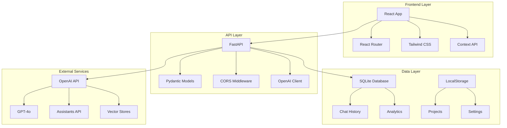

# 📚 Documentation Technique - DDB TGI Audience Manager

## 📋 Table des Matières

- [🏗️ Architecture Technique](#️-architecture-technique)
- [🔧 Backend FastAPI](#-backend-fastapi)
- [⚛️ Frontend React](#️-frontend-react)
- [🗄️ Base de Données](#️-base-de-données)
- [🤖 Intégration OpenAI](#-intégration-openai)
- [🔐 Sécurité](#-sécurité)
- [📊 Analytics](#-analytics)
- [🚀 Déploiement](#-déploiement)
- [🧪 Tests](#-tests)
- [🔍 Monitoring](#-monitoring)

## 🏗️ Architecture Technique

### **Vue d'Ensemble**



### **Flux de Données**

1. **Authentification** : LocalStorage → AuthContext → Protected Routes
2. **Projets** : LocalStorage → Settings → API Headers
3. **Assistants** : API → AssistantContext → Components
4. **Chat** : Components → API → OpenAI → Database
5. **Analytics** : Database → API → Charts

### **Patterns Architecturaux**

- **Frontend** : Component-Based Architecture (React)
- **Backend** : RESTful API avec FastAPI
- **State Management** : React Context + LocalStorage
- **Data Flow** : Unidirectional (Flux pattern)
- **Error Handling** : Centralized avec try/catch + toasts

## 🔧 Backend FastAPI

### **Structure du Backend**

```
backend/
├── main.py              # Point d'entrée FastAPI
├── database.py          # Configuration SQLite
├── requirements.txt     # Dépendances Python
└── ddb_manager.db      # Base de données SQLite
```

### **Configuration FastAPI**

```python
# main.py
from fastapi import FastAPI, HTTPException, Header, File, UploadFile, Form
from fastapi.middleware.cors import CORSMiddleware
from fastapi.responses import JSONResponse
import sqlite3
import os
from datetime import datetime
import json
from openai import OpenAI
from typing import Optional, Dict, Any
import tempfile
import uuid

app = FastAPI(
    title="DDB TGI Audience Manager API",
    description="API pour la gestion d'assistants IA d'analyse TGI",
    version="2.0.0"
)

# Configuration CORS
app.add_middleware(
    CORSMiddleware,
    allow_origins=["http://localhost:3000"],
    allow_credentials=True,
    allow_methods=["*"],
    allow_headers=["*"],
)
```

### **Gestion Multi-Tenant**

```python
# Cache des clients OpenAI par clé API
client_cache: Dict[str, OpenAI] = {}

def get_openai_client(api_key: str = None) -> OpenAI:
    """Récupère ou crée un client OpenAI pour une clé API donnée"""
    if not api_key:
        api_key = DEFAULT_OPENAI_API_KEY
    
    if api_key not in client_cache:
        client_cache[api_key] = OpenAI(api_key=api_key)
    
    return client_cache[api_key]

def get_api_key_from_header(x_openai_key: Optional[str] = Header(None)) -> str:
    """Extrait la clé API depuis les headers ou utilise celle par défaut"""
    return x_openai_key or DEFAULT_OPENAI_API_KEY
```

### **Endpoints Principaux**

#### **Assistants Management**

```python
@app.get("/assistants")
async def get_assistants(api_key: str = Depends(get_api_key_from_header)):
    """Liste tous les assistants pour une clé API donnée"""
    try:
        client = get_openai_client(api_key)
        assistants = client.beta.assistants.list()
        
        result = []
        for assistant in assistants.data:
            # Récupération des métadonnées depuis la DB
            db_data = get_assistant_from_db(assistant.id)
            result.append({
                "id": assistant.id,
                "name": assistant.name,
                "theme": db_data.get("theme", ""),
                "created_at": assistant.created_at,
                "file_name": db_data.get("file_name", ""),
                "file_type": db_data.get("file_type", ""),
                "message_count": get_message_count(assistant.id)
            })
        
        return {"data": result}
    except Exception as e:
        raise HTTPException(status_code=500, detail=str(e))
```

#### **Chat Management**

```python
@app.post("/assistants/{assistant_id}/chat")
async def chat_with_assistant(
    assistant_id: str,
    request: ChatRequest,
    api_key: str = Depends(get_api_key_from_header)
):
    """Envoie un message à un assistant et retourne la réponse"""
    try:
        client = get_openai_client(api_key)
        
        # Récupération ou création du thread
        thread_key = f"{assistant_id}_{api_key[:10]}"
        thread_id = get_or_create_thread(thread_key, client)
        
        # Ajout du message utilisateur
        client.beta.threads.messages.create(
            thread_id=thread_id,
            role="user",
            content=request.message
        )
        
        # Exécution de l'assistant
        run = client.beta.threads.runs.create(
            thread_id=thread_id,
            assistant_id=assistant_id
        )
        
        # Attente de la réponse
        response = wait_for_run_completion(client, thread_id, run.id)
        
        # Sauvegarde en base
        save_chat_message(assistant_id, "user", request.message)
        save_chat_message(assistant_id, "assistant", response)
        
        return {"response": response}
        
    except Exception as e:
        raise HTTPException(status_code=500, detail=str(e))
```

### **Gestion des Erreurs**

```python
@app.exception_handler(HTTPException)
async def http_exception_handler(request, exc):
    return JSONResponse(
        status_code=exc.status_code,
        content={
            "detail": exc.detail,
            "timestamp": datetime.now().isoformat(),
            "path": str(request.url)
        }
    )

@app.exception_handler(Exception)
async def general_exception_handler(request, exc):
    return JSONResponse(
        status_code=500,
        content={
            "detail": "Erreur interne du serveur",
            "timestamp": datetime.now().isoformat(),
            "path": str(request.url)
        }
    )
```

## ⚛️ Frontend React

### **Structure du Frontend**

```
frontend/src/
├── components/          # Composants réutilisables
│   └── Sidebar.js      # Navigation principale
├── contexts/           # Gestion d'état globale
│   ├── AuthContext.js  # Authentification
│   └── AssistantContext.js # Assistants
├── pages/              # Pages de l'application
│   ├── Dashboard.js    # Tableau de bord
│   ├── Assistants.js   # Liste des assistants
│   ├── CreateAssistant.js # Création d'assistant
│   ├── Chat.js         # Interface de chat
│   ├── Analytics.js    # Analytics
│   ├── Settings.js     # Gestion des projets
│   └── Login.js        # Connexion
├── services/           # Services API
│   └── api.js         # Client REST
├── App.js             # Composant racine
└── index.js           # Point d'entrée
```

### **Context API - Gestion d'État**

#### **AuthContext**

```javascript
// contexts/AuthContext.js
const AuthContext = createContext();

export const AuthProvider = ({ children }) => {
  const [user, setUser] = useState(null);
  const [loading, setLoading] = useState(true);

  useEffect(() => {
    // Récupération de l'utilisateur depuis localStorage
    const savedUser = localStorage.getItem('user');
    if (savedUser) {
      setUser(JSON.parse(savedUser));
    }
    setLoading(false);
  }, []);

  const login = (userData) => {
    setUser(userData);
    localStorage.setItem('user', JSON.stringify(userData));
  };

  const logout = () => {
    setUser(null);
    localStorage.removeItem('user');
    // Nettoyage des autres données
    localStorage.removeItem('openai_projects');
    localStorage.removeItem('current_project_id');
  };

  return (
    <AuthContext.Provider value={{ user, login, logout, loading }}>
      {children}
    </AuthContext.Provider>
  );
};
```

#### **AssistantContext**

```javascript
// contexts/AssistantContext.js
export const AssistantProvider = ({ children }) => {
  const [assistants, setAssistants] = useState([]);
  const [selectedAssistant, setSelectedAssistant] = useState(null);
  const [chatHistory, setChatHistory] = useState({});
  const [loading, setLoading] = useState(false);

  const refreshAssistants = async () => {
    try {
      // Effacement de l'état actuel
      setAssistants([]);
      setSelectedAssistant(null);
      setChatHistory({});
      
      // Rechargement avec la nouvelle clé API
      await loadAssistants();
      
      toast.success('Assistants rechargés avec succès');
    } catch (error) {
      console.error('Error refreshing assistants:', error);
      toast.error('Erreur lors du rechargement des assistants');
    }
  };

  const createAssistant = async (assistantData, file) => {
    try {
      setLoading(true);
      const formData = new FormData();
      formData.append('name', assistantData.name);
      formData.append('theme', assistantData.theme);
      formData.append('file', file);

      const response = await assistantAPI.createAssistant(formData);
      
      // Rechargement de la liste
      await loadAssistants();
      
      return { success: true, data: response.data };
    } catch (error) {
      return { success: false, error: error.message };
    } finally {
      setLoading(false);
    }
  };

  // ... autres méthodes
};
```

### **Services API**

```javascript
// services/api.js
const API_BASE_URL = 'http://localhost:8000';

class ApiClient {
  constructor() {
    this.baseURL = API_BASE_URL;
  }

  async request(endpoint, options = {}) {
    const url = `${this.baseURL}${endpoint}`;
    
    // Ajout automatique de la clé API depuis localStorage
    const apiKey = localStorage.getItem('openai_api_key');
    const headers = {
      'Content-Type': 'application/json',
      ...options.headers,
    };
    
    if (apiKey) {
      headers['X-OpenAI-Key'] = apiKey;
    }

    const config = {
      ...options,
      headers,
    };

    try {
      const response = await fetch(url, config);
      
      if (!response.ok) {
        const errorData = await response.json();
        throw new Error(errorData.detail || 'Erreur API');
      }
      
      return await response.json();
    } catch (error) {
      console.error('API Error:', error);
      throw error;
    }
  }

  // Méthodes spécifiques
  async getAssistants() {
    return this.request('/assistants');
  }

  async createAssistant(formData) {
    return this.request('/assistants', {
      method: 'POST',
      body: formData,
      headers: {} // Pas de Content-Type pour FormData
    });
  }

  async sendMessage(assistantId, message) {
    return this.request(`/assistants/${assistantId}/chat`, {
      method: 'POST',
      body: JSON.stringify({ message }),
    });
  }
}

export const assistantAPI = new ApiClient();
```

### **Composants Clés**

#### **CreateAssistant - Interface en 3 Étapes**

```javascript
// pages/CreateAssistant.js
const CreateAssistant = () => {
  const [step, setStep] = useState(1);
  const [formData, setFormData] = useState({
    name: '',
    theme: '',
    file: null
  });
  const [progress, setProgress] = useState({
    fileValidation: false,
    vectorStore: false,
    assistantCreation: false,
    completed: false
  });

  const handleSubmit = async () => {
    setLoading(true);
    setStep(3);

    try {
      // Simulation de progression
      setProgress(prev => ({ ...prev, fileValidation: true }));
      await new Promise(resolve => setTimeout(resolve, 800));

      setProgress(prev => ({ ...prev, vectorStore: true }));
      await new Promise(resolve => setTimeout(resolve, 1500));

      setProgress(prev => ({ ...prev, assistantCreation: true }));
      
      // Création réelle
      const result = await createAssistant(formData, formData.file);
      
      if (result.success) {
        setProgress(prev => ({ ...prev, completed: true }));
        navigate('/assistants');
      }
    } catch (error) {
      // Gestion d'erreur
    }
  };

  return (
    <div className="flex-1 overflow-y-auto bg-gray-50 h-screen">
      {/* Interface en 3 étapes avec progression visuelle */}
    </div>
  );
};
```

## 🗄️ Base de Données

### **Schéma SQLite**

```sql
-- Table des assistants
CREATE TABLE assistants (
    id TEXT PRIMARY KEY,
    name TEXT NOT NULL,
    theme TEXT,
    file_name TEXT,
    file_type TEXT,
    created_at TIMESTAMP DEFAULT CURRENT_TIMESTAMP,
    api_key_hash TEXT -- Hash de la clé API pour isolation
);

-- Table des conversations
CREATE TABLE chat_messages (
    id INTEGER PRIMARY KEY AUTOINCREMENT,
    assistant_id TEXT NOT NULL,
    role TEXT NOT NULL, -- 'user' ou 'assistant'
    content TEXT NOT NULL,
    timestamp TIMESTAMP DEFAULT CURRENT_TIMESTAMP,
    api_key_hash TEXT,
    FOREIGN KEY (assistant_id) REFERENCES assistants (id)
);

-- Table des threads OpenAI
CREATE TABLE threads (
    id TEXT PRIMARY KEY,
    assistant_id TEXT NOT NULL,
    thread_id TEXT NOT NULL,
    api_key_hash TEXT,
    created_at TIMESTAMP DEFAULT CURRENT_TIMESTAMP,
    FOREIGN KEY (assistant_id) REFERENCES assistants (id)
);

-- Table des analytics
CREATE TABLE analytics (
    id INTEGER PRIMARY KEY AUTOINCREMENT,
    event_type TEXT NOT NULL, -- 'message_sent', 'assistant_created', etc.
    assistant_id TEXT,
    data JSON, -- Données additionnelles
    timestamp TIMESTAMP DEFAULT CURRENT_TIMESTAMP,
    api_key_hash TEXT
);

-- Index pour les performances
CREATE INDEX idx_chat_messages_assistant_id ON chat_messages(assistant_id);
CREATE INDEX idx_chat_messages_timestamp ON chat_messages(timestamp);
CREATE INDEX idx_analytics_timestamp ON analytics(timestamp);
CREATE INDEX idx_analytics_event_type ON analytics(event_type);
```

### **Fonctions de Base de Données**

```python
# database.py
import sqlite3
import hashlib
from datetime import datetime
from typing import List, Dict, Any

class DatabaseManager:
    def __init__(self, db_path: str = "ddb_manager.db"):
        self.db_path = db_path
        self.init_database()
    
    def get_connection(self):
        conn = sqlite3.connect(self.db_path)
        conn.row_factory = sqlite3.Row
        return conn
    
    def hash_api_key(self, api_key: str) -> str:
        """Hash de la clé API pour l'isolation des données"""
        return hashlib.sha256(api_key.encode()).hexdigest()[:16]
    
    def save_assistant(self, assistant_id: str, name: str, theme: str, 
                      file_name: str, file_type: str, api_key: str):
        """Sauvegarde un assistant en base"""
        with self.get_connection() as conn:
            conn.execute("""
                INSERT OR REPLACE INTO assistants 
                (id, name, theme, file_name, file_type, api_key_hash)
                VALUES (?, ?, ?, ?, ?, ?)
            """, (assistant_id, name, theme, file_name, file_type, 
                  self.hash_api_key(api_key)))
    
    def get_assistants_by_api_key(self, api_key: str) -> List[Dict]:
        """Récupère les assistants pour une clé API donnée"""
        with self.get_connection() as conn:
            cursor = conn.execute("""
                SELECT * FROM assistants 
                WHERE api_key_hash = ?
                ORDER BY created_at DESC
            """, (self.hash_api_key(api_key),))
            return [dict(row) for row in cursor.fetchall()]
    
    def save_chat_message(self, assistant_id: str, role: str, 
                         content: str, api_key: str):
        """Sauvegarde un message de chat"""
        with self.get_connection() as conn:
            conn.execute("""
                INSERT INTO chat_messages 
                (assistant_id, role, content, api_key_hash)
                VALUES (?, ?, ?, ?)
            """, (assistant_id, role, content, self.hash_api_key(api_key)))
    
    def get_chat_history(self, assistant_id: str, api_key: str) -> List[Dict]:
        """Récupère l'historique de chat pour un assistant"""
        with self.get_connection() as conn:
            cursor = conn.execute("""
                SELECT role, content, timestamp 
                FROM chat_messages 
                WHERE assistant_id = ? AND api_key_hash = ?
                ORDER BY timestamp ASC
            """, (assistant_id, self.hash_api_key(api_key)))
            return [dict(row) for row in cursor.fetchall()]
```

## 🤖 Intégration OpenAI

### **Configuration des Assistants**

```python
def create_assistant_with_file(client: OpenAI, name: str, theme: str, 
                              file_content: str, file_name: str) -> str:
    """Crée un assistant OpenAI avec un fichier de données"""
    
    # Instructions spécialisées TGI
    instructions = f"""
Tu es un expert en analyse de données TGI (Target Group Index) spécialisé dans le secteur {theme}.

CONTEXTE TGI :
- Les indices TGI mesurent la surreprésentation d'un segment par rapport à la population générale
- Un indice > 100 = surreprésentation, < 100 = sous-représentation
- Les % Vert = pourcentage vertical (part du segment dans la cible)
- Les % Horz = pourcentage horizontal (part de la cible dans le segment)

INSTRUCTIONS :
1. Analyse les données fournies avec expertise TGI
2. Identifie les segments les plus performants (indices élevés)
3. Explique les insights en termes marketing
4. Propose des recommandations stratégiques
5. Utilise un langage professionnel mais accessible

DONNÉES DISPONIBLES :
Le fichier contient des données structurées avec les champs :
- Interview : caractéristiques démographiques
- Segment : segments étudiés  
- Indice : indicateurs de surreprésentation
- % Vert/Horz : pourcentages d'analyse

Réponds toujours en français et structure tes analyses de manière claire.
"""

    try:
        # Création du vector store
        vector_store = client.beta.vector_stores.create(
            name=f"Data_{name}_{datetime.now().strftime('%Y%m%d_%H%M%S')}"
        )
        
        # Upload du fichier
        with tempfile.NamedTemporaryFile(mode='w', suffix='.json', delete=False) as tmp_file:
            tmp_file.write(file_content)
            tmp_file.flush()
            
            with open(tmp_file.name, 'rb') as file_obj:
                file_upload = client.files.create(
                    file=file_obj,
                    purpose="assistants"
                )
        
        # Ajout du fichier au vector store
        client.beta.vector_stores.files.create(
            vector_store_id=vector_store.id,
            file_id=file_upload.id
        )
        
        # Création de l'assistant
        assistant = client.beta.assistants.create(
            name=name,
            instructions=instructions,
            model="gpt-4o",
            tools=[{"type": "file_search"}],
            tool_resources={
                "file_search": {
                    "vector_store_ids": [vector_store.id]
                }
            }
        )
        
        return assistant.id
        
    except Exception as e:
        raise Exception(f"Erreur lors de la création de l'assistant : {str(e)}")
```

### **Gestion des Conversations**

```python
def wait_for_run_completion(client: OpenAI, thread_id: str, run_id: str, 
                           timeout: int = 60) -> str:
    """Attend la completion d'un run OpenAI et retourne la réponse"""
    
    start_time = time.time()
    
    while time.time() - start_time < timeout:
        run = client.beta.threads.runs.retrieve(
            thread_id=thread_id,
            run_id=run_id
        )
        
        if run.status == "completed":
            # Récupération des messages
            messages = client.beta.threads.messages.list(
                thread_id=thread_id,
                order="desc",
                limit=1
            )
            
            if messages.data:
                message_content = messages.data[0].content[0]
                if hasattr(message_content, 'text'):
                    return message_content.text.value
            
            return "Réponse vide de l'assistant"
            
        elif run.status in ["failed", "cancelled", "expired"]:
            raise Exception(f"Run failed with status: {run.status}")
        
        time.sleep(1)
    
    raise Exception("Timeout waiting for assistant response")
```

## 🔐 Sécurité

### **Isolation Multi-Tenant**

```python
# Isolation par hash de clé API
def get_isolated_data(api_key: str, query_func):
    """Wrapper pour isoler les données par clé API"""
    api_key_hash = hashlib.sha256(api_key.encode()).hexdigest()[:16]
    return query_func(api_key_hash)

# Validation des clés API
def validate_openai_key(api_key: str) -> bool:
    """Valide une clé API OpenAI"""
    if not api_key or not api_key.startswith('sk-'):
        return False
    
    try:
        client = OpenAI(api_key=api_key)
        client.models.list()
        return True
    except:
        return False
```

### **Sanitization des Données**

```python
def sanitize_file_content(content: str) -> str:
    """Nettoie le contenu des fichiers uploadés"""
    # Suppression des caractères dangereux
    content = re.sub(r'[<>"\']', '', content)
    
    # Validation JSON si applicable
    try:
        json.loads(content)
    except:
        raise ValueError("Format JSON invalide")
    
    return content

def validate_assistant_name(name: str) -> bool:
    """Valide le nom d'un assistant"""
    if not name or len(name) < 3 or len(name) > 100:
        return False
    
    # Caractères autorisés seulement
    if not re.match(r'^[a-zA-Z0-9\s\-_]+$', name):
        return False
    
    return True
```

## 📊 Analytics

### **Collecte de Métriques**

```python
class AnalyticsManager:
    def __init__(self, db_manager: DatabaseManager):
        self.db = db_manager
    
    def track_event(self, event_type: str, assistant_id: str = None, 
                   data: Dict = None, api_key: str = None):
        """Enregistre un événement analytics"""
        with self.db.get_connection() as conn:
            conn.execute("""
                INSERT INTO analytics 
                (event_type, assistant_id, data, api_key_hash)
                VALUES (?, ?, ?, ?)
            """, (
                event_type,
                assistant_id,
                json.dumps(data) if data else None,
                self.db.hash_api_key(api_key) if api_key else None
            ))
    
    def get_dashboard_metrics(self, api_key: str) -> Dict:
        """Récupère les métriques pour le dashboard"""
        api_key_hash = self.db.hash_api_key(api_key)
        
        with self.db.get_connection() as conn:
            # Nombre total d'assistants
            assistants_count = conn.execute("""
                SELECT COUNT(*) as count FROM assistants 
                WHERE api_key_hash = ?
            """, (api_key_hash,)).fetchone()['count']
            
            # Messages aujourd'hui
            messages_today = conn.execute("""
                SELECT COUNT(*) as count FROM chat_messages 
                WHERE api_key_hash = ? AND DATE(timestamp) = DATE('now')
            """, (api_key_hash,)).fetchone()['count']
            
            # Assistant le plus utilisé
            most_used = conn.execute("""
                SELECT assistant_id, COUNT(*) as count 
                FROM chat_messages 
                WHERE api_key_hash = ?
                GROUP BY assistant_id 
                ORDER BY count DESC 
                LIMIT 1
            """, (api_key_hash,)).fetchone()
            
            return {
                "assistants_count": assistants_count,
                "messages_today": messages_today,
                "most_used_assistant": most_used['assistant_id'] if most_used else None,
                "total_messages": self.get_total_messages(api_key_hash)
            }
```

### **Graphiques Frontend**

```javascript
// components/DashboardChart.js
import { Chart as ChartJS, CategoryScale, LinearScale, PointElement, LineElement, Title, Tooltip, Legend } from 'chart.js';
import { Line } from 'react-chartjs-2';

ChartJS.register(CategoryScale, LinearScale, PointElement, LineElement, Title, Tooltip, Legend);

const DashboardChart = ({ data }) => {
  const chartData = {
    labels: data.labels,
    datasets: [
      {
        label: 'Messages par jour',
        data: data.values,
        borderColor: '#F0C527', // DDB Yellow
        backgroundColor: 'rgba(240, 197, 39, 0.1)',
        tension: 0.4,
      },
    ],
  };

  const options = {
    responsive: true,
    plugins: {
      legend: {
        position: 'top',
      },
      title: {
        display: true,
        text: 'Activité des 7 derniers jours',
      },
    },
    scales: {
      y: {
        beginAtZero: true,
      },
    },
  };

  return <Line data={chartData} options={options} />;
};
```

## 🚀 Déploiement

### **Docker Configuration**

```dockerfile
# Dockerfile.backend
FROM python:3.9-slim

WORKDIR /app

COPY backend/requirements.txt .
RUN pip install --no-cache-dir -r requirements.txt

COPY backend/ .

EXPOSE 8000

CMD ["uvicorn", "main:app", "--host", "0.0.0.0", "--port", "8000"]
```

```dockerfile
# Dockerfile.frontend
FROM node:18-alpine

WORKDIR /app

COPY frontend/package*.json ./
RUN npm ci --only=production

COPY frontend/ .
RUN npm run build

FROM nginx:alpine
COPY --from=0 /app/build /usr/share/nginx/html
COPY nginx.conf /etc/nginx/nginx.conf

EXPOSE 80
```

### **Docker Compose**

```yaml
# docker-compose.yml
version: '3.8'

services:
  backend:
    build:
      context: .
      dockerfile: Dockerfile.backend
    ports:
      - "8000:8000"
    environment:
      - OPENAI_API_KEY=${OPENAI_API_KEY}
    volumes:
      - ./data:/app/data
    restart: unless-stopped

  frontend:
    build:
      context: .
      dockerfile: Dockerfile.frontend
    ports:
      - "3000:80"
    depends_on:
      - backend
    restart: unless-stopped

  nginx:
    image: nginx:alpine
    ports:
      - "80:80"
      - "443:443"
    volumes:
      - ./nginx.conf:/etc/nginx/nginx.conf
      - ./ssl:/etc/nginx/ssl
    depends_on:
      - frontend
      - backend
    restart: unless-stopped
```

### **Scripts de Déploiement**

```bash
#!/bin/bash
# deploy.sh

set -e

echo "🚀 Déploiement DDB TGI Audience Manager"

# Variables
ENVIRONMENT=${1:-production}
VERSION=$(git describe --tags --always)

echo "📦 Building version $VERSION for $ENVIRONMENT"

# Build des images
docker-compose build

# Tag des images
docker tag ddb-tgi-backend:latest ddb-tgi-backend:$VERSION
docker tag ddb-tgi-frontend:latest ddb-tgi-frontend:$VERSION

# Déploiement
if [ "$ENVIRONMENT"
